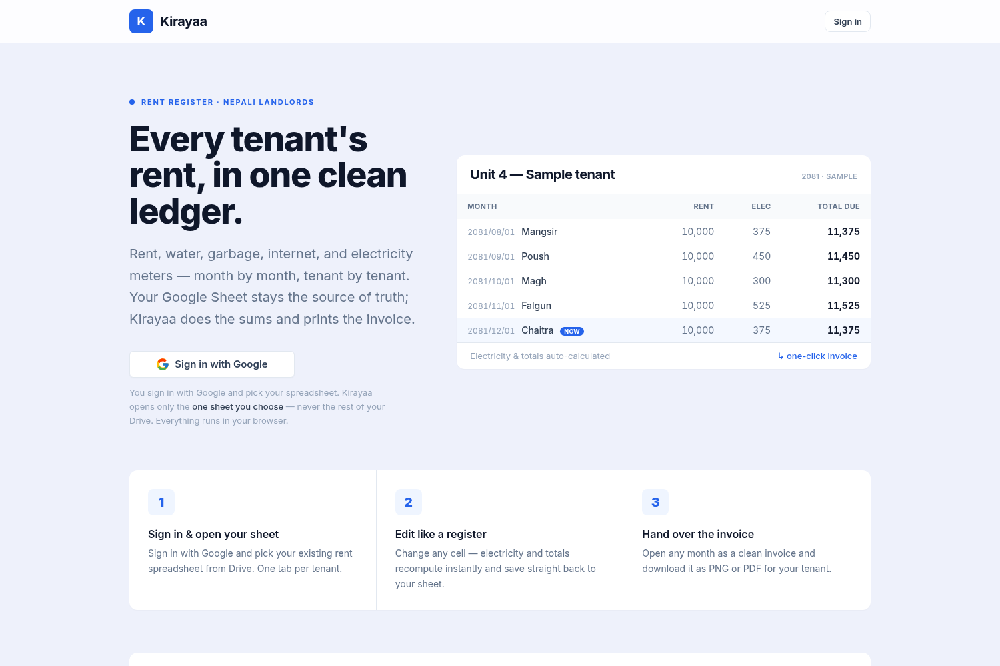
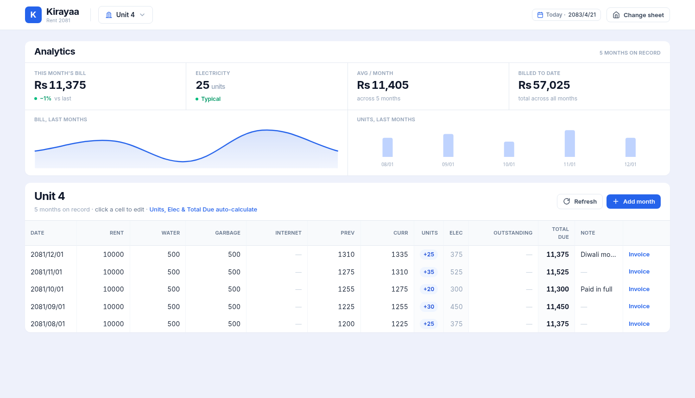
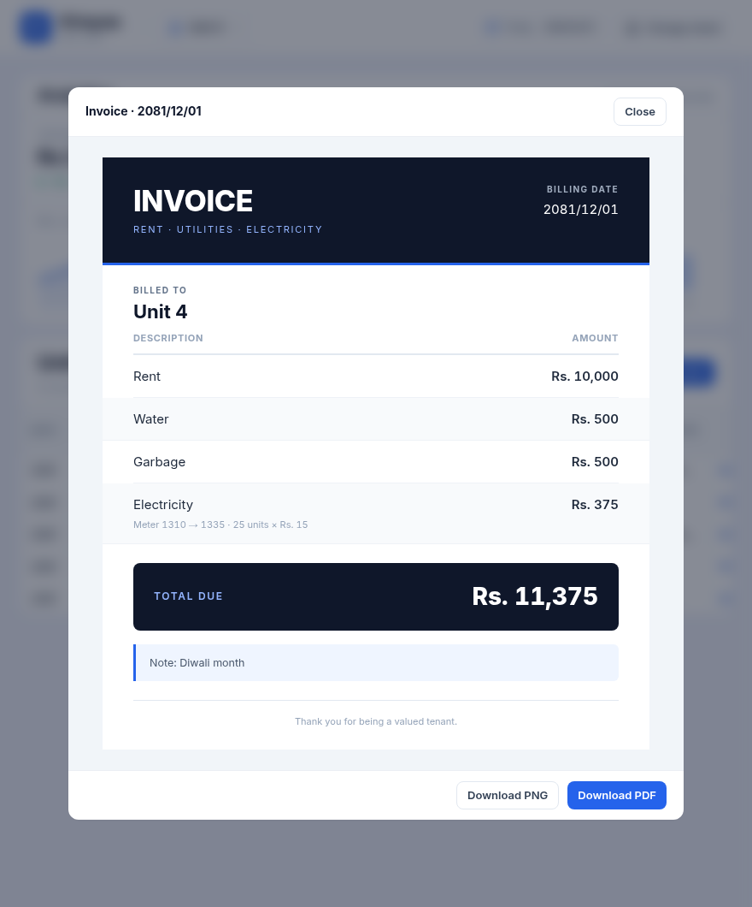

<div align="center">

# 🔑 Kirayaa — *rent, sorted.*

**A clean, single-page console for landlords to track rent, utilities, and electricity meters across tenants — with your Google Sheet as the source of truth and one-click invoices.**

No backend. No database. The browser reads and writes your Google Sheet directly, so your data never leaves your Google account.



</div>

---

## What it is

Kirayaa is a **browser-only app** (Svelte 5 + Vite + Tailwind v4, charts by Chart.js). You sign in with Google, pick your existing rent spreadsheet, and edit it like a fast, focused dashboard:

- one **tab per tenant**, chosen from a dropdown;
- an **editable grid** — click any cell, and the change (plus recomputed electricity + totals) writes straight back to your sheet;
- a compact **analytics** band — this month's bill (with change vs. last month), electricity units with an anomaly flag, average bill, and total billed to date, plus bill/units trend charts;
- **one-click invoices** you can download as PNG or PDF for each month.

It's built to open once a month, calculate rent, and send bills — fast.



**Invoices** are generated from each row and open in a popup with **Download PNG / PDF**. Any note on the row prints on the bill.

<div align="center"></div>

---

## Features

- 🔐 **Sign in with Google**, then pick your sheet from Drive's own file chooser — least-privilege `drive.file` scope means the app can only touch the one file you pick.
- 📝 **Editable spreadsheet** — edits are *optimistic* (instant UI) and write through to Google Sheets in the background.
- ⚡ **Electricity from the meter** — enter Prev/Curr readings; units, electricity, and the total recompute automatically.
- 📊 **Dense analytics** — this-month bill (with % change), an electricity **anomaly flag** (higher / typical / lower than the tenant's average), average monthly bill, total billed to date, and bill/units trend charts.
- 🧾 **Invoices** — clean PNG/PDF per month, with the tenant's note included.
- ➕ **Add month** (auto-filled from the previous month) · 🗑 **delete row** (with confirmation) · ✏️ **rename tab** — all write to the sheet.
- 🗓 **Bikram Sambat (B.S.) dates**, newest month on top.
- 🔄 **Always fresh** — every open re-reads the sheet directly (no stale local copy), so edits you make in Google Sheets show up without a hard refresh.
- 🧭 **Routes** — a landing page at `/` and the dashboard at `/dashboard`; a valid session lands straight on the dashboard.
- 🌐 **No server** — deployable as a static site (e.g. GitHub Pages).

---

## How it works

1. **Sign in & pick your sheet.** Google's Picker lists your spreadsheets; choose your rent tracker — you're taken to the **dashboard** (`/dashboard`).
2. **Pick a tenant** from the dropdown (one tab per tenant).
3. **Edit the grid.** Change any cell — electricity and the total recompute and save back to your sheet.
4. **Add the new month** with one click (it carries over rent/water/garbage/internet and last month's meter).
5. **Open the invoice** for any month and download the PNG or PDF.

---

## Sheet format

One tab per tenant, columns in this order (**A → L**):

| Col | Header | Filled by | Meaning |
|-----|--------|-----------|---------|
| A | Date | text | B.S. date, 1st of month — `2081/12/1` |
| B | Rent | you | Monthly rent |
| C | Water | you | Water charge |
| D | Garbage | you | Garbage charge |
| E | Internet | you | Internet charge — blank if none |
| F | Prev Meter | you | Last month's electricity reading |
| G | Curr Meter | you | This month's reading |
| H | Units | **auto** | `Curr − Prev` |
| I | Electricity | **auto** | `Units × rate` (default Rs. 15) |
| J | Outstanding | you | Unpaid balance carried in — blank if none |
| K | Total Due | **auto** | `Rent + Water + Garbage + Internet + Electricity + Outstanding` |
| L | Note | text | Free-text — printed on the invoice |

- The **auto** columns are computed and written back on save — you can leave them blank.
- Each row is **self-contained** (stores both meters), so invoices don't depend on the row above.
- The **tab name is the tenant name** (e.g. `Unit 4`) and is used as the default invoice title — no header or title row needed.
- **Tip:** set the Date column's format to **Plain text** (Format → Number → Plain text) so Google doesn't convert B.S. dates into real dates.

---

## Setup

### 1. Prerequisites

- Node.js 20+
- A Google account that can edit the rent spreadsheet
- Two **public** Google Cloud credentials — an OAuth **Web client ID** and an **API key** (free, ~5 min). No client secret is ever used.

### 2. Google Cloud (one-time)

You sign in with Google and pick the sheet from Drive's chooser (the **Google Picker**). The app uses the least-privilege `drive.file` scope — it can only open the **one file you pick**, never the rest of your Drive.

1. [console.cloud.google.com](https://console.cloud.google.com) → **Create project**.
2. **APIs & Services → Library** → enable **Google Sheets API** and **Google Picker API**.
3. **OAuth consent screen** → User type **External** → add your Google account under **Test users**.
4. **Credentials → + Create Credentials → OAuth client ID** → **Web application**
   - **Authorized JavaScript origins:** `http://localhost:5173` (add your deploy URL later). No redirect URI needed.
   - Copy the **Client ID**.
5. **Credentials → + Create Credentials → API key** → copy it (recommended: restrict it to your origins and the Picker API).

### 3. Configure & run

```bash
cp .env.example .env
# set VITE_GOOGLE_CLIENT_ID and VITE_GOOGLE_API_KEY in .env

npm install
npm run dev        # http://localhost:5173
```

Click **Sign in with Google**, grant access (click through the "unverified app" notice — normal for a personal app), and pick your spreadsheet. The session is remembered, so a refresh reopens straight into the dashboard; it signs in fresh once the token lapses (~1h).

### 4. Build & deploy

```bash
npm run build      # static site in dist/
npm run preview    # serve the built site locally
```

`dist/` is a static bundle you can host anywhere (e.g. GitHub Pages). Add the deployed origin to your OAuth client's **Authorized JavaScript origins**.

> **Deploying with the `/dashboard` route:** the app uses real paths, so a static host must fall back to `index.html` for unknown routes. On GitHub Pages, add a `404.html` that serves the same app (SPA fallback) so a direct visit or hard refresh on `/dashboard` doesn't 404.

---

## Data & privacy

- **All data lives in your Google Sheet.** The app has no backend and stores nothing server-side.
- **No local copy of your sheet.** Kirayaa keeps no cache of your rows — every open re-reads the sheet directly, so it's always current. Only the tiny config (which sheet, which tab) is remembered in `localStorage`.
- **Edits are optimistic + write-through** — the UI updates instantly and the change is written to Sheets in the background; a **Refresh** button re-pulls the current tab on demand.
- **The OAuth token stays in your browser** (`localStorage`), carrying Google's ~1h expiry.
- The only network calls are to Google (`accounts.google.com`, `apis.google.com`, `sheets.googleapis.com`).
- `.env` and build output are git-ignored; only a **public** client ID + API key are ever shipped.

---

## Tech stack

- **UI:** [Svelte 5](https://svelte.dev/) + [Vite](https://vite.dev/), styled with [Tailwind CSS v4](https://tailwindcss.com/); charts by [Chart.js](https://www.chartjs.org/).
- **Auth:** Google Identity Services token flow, `drive.file` scope (public client ID, no secret).
- **Sheet picking:** the [Google Picker](https://developers.google.com/drive/picker/guides/overview).
- **Data:** the Google Sheets REST API, called directly from the browser.
- **Invoices:** an HTML/CSS bill rasterized with [html2canvas](https://html2canvas.hertzen.com/) (PNG) and [jsPDF](https://github.com/parallax/jsPDF) (PDF) — both lazy-loaded, only when you export.

## Project layout

```
index.html              app entry
src/
  main.js               mounts <App>
  App.svelte            router: landing (/) · dashboard (/dashboard) · sign-in gate
  components/           Landing, TopBar, Strip, Sheet, Row, InvoiceModal,
                        GoogleButton, TrendChart, UnitsChart
  lib/
    store.svelte.js     reactive controller (state, optimistic writes, always-fresh loads)
    router.svelte.js    tiny path router (landing / dashboard)
    sheets.js           Sheets REST client + row parse/serialize   (+ .test.js)
    auth.js             Google Identity Services token flow (drive.file)
    picker.js           Google Picker — choose a spreadsheet from Drive
    charts.js           Chart.js registration
    config.js           localStorage (sheet, tab, unit rate, titles)
    calc.js             bill math                                   (+ .test.js)
    nepali.js           Bikram Sambat date helpers                  (+ .test.js)
    chart.js            trend-line point builder                    (+ .test.js)
    invoice.js          invoice model + PNG/PDF export
  styles/app.css        Tailwind theme + design system
```

## Testing

```bash
npm test
```

Unit tests (Vitest) cover the bill math, B.S. date handling, the sparkline, and the Sheets row parsing/serialization — including tolerance for reformatted dates.

## License

MIT.
